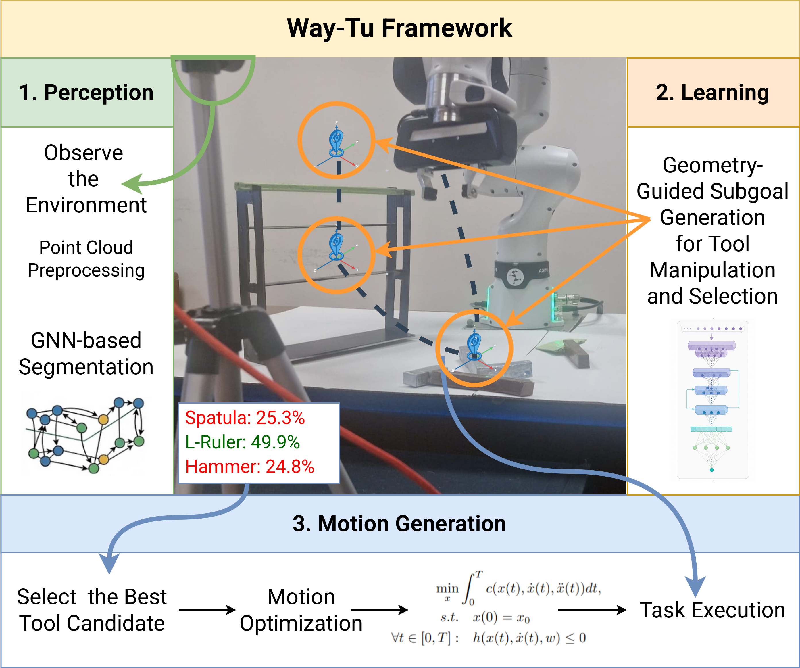

# Way-Tu: A Framework for Tool Selection and Manipulation Using Waypoint Representations

This repository contains the implementation of **Way-Tu**, a learning-based framework for tool selection and tool manipulation using waypoint representations.

The framework takes point cloud observations of a manipulation scene and predicts task-relevant waypoints for candidate tools. These predicted waypoints are then used as structured subgoals for motion generation. Tool candidates are evaluated based on their predicted manipulation performance, allowing the system to select a suitable tool for the given task.

## Overview

  

Way-Tu consists of three main components:

1. **Perception**  
   The environment is observed as a point cloud. Point cloud preprocessing and segmentation are used to identify tools and task-relevant objects in the scene.

2. **Geometry-Guided Subgoal Generation**  
   A neural network processes the tool and environment geometry and predicts waypoint representations, such as grasp and interaction-related subgoals.

3. **Motion Generation**  
   The predicted waypoints are used in a motion optimization pipeline to generate executable robot motions.

## Simulation and Optimization

The simulation environment and motion generation pipeline are based on **RAI**.  
RAI is used for scene construction, robot simulation, and trajectory optimization through KOMO.
The code was developed and tested with **RAI version 0.1.10**. Since the RAI API may differ across versions, some modifications may be required when using newer releases.

## Tasks

The framework is evaluated on tool manipulation tasks such as:

- Minigolf
- Lifting
- Hammering
